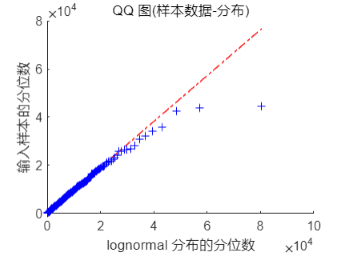
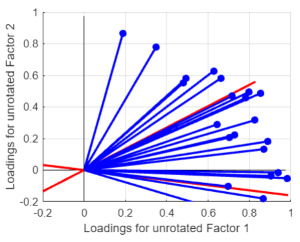
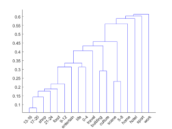
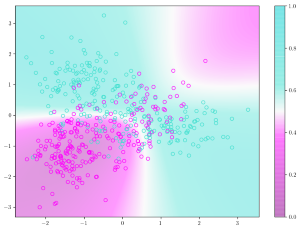
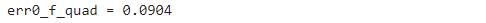

# 打卡软件Swarm

> Swarm 是 4sq 的一款依靠签到的社交应用。用户可以在自己感兴趣的地点打卡发照片，展示给好友。
>
> 本数据集中给出了三个城市范围内的签到数据和对应签到用户的个人信息数据，分别是纽约市（nyc）、旧金山（sfo）和香港（hk）。
>
> 各城市的签到数据包括 8 个字段：用户 id，本地/外地，签到地点 id， 地点类型，地点类型 id，地点经度、纬度，签到时间。
> 各城市对应签到的用 户数据包括 6 个字段：用户 id，本地/外地，男/女，签到发布数，照片发布 数，好友数。
>
> 众所周知位置信息具有非常巨大的商业价值。

**打卡的对数正态分布？**

**用户偏好的因子模型？**

**判别本地还是外来？**

---

下载链接：

<a href="./SwarmData.zip" download>原数据集</a>

<a href="./Swarm.pdf" download>(几乎)完整报告</a>

<a href="./SwarMatlab.zip" download>源代码</a>（包括实时脚本、函数及工作区快照，较大）