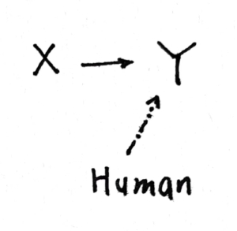

# Notion: Settability

### 可设性

因果图作为一种常见的因果推断甚至因果识别的表示方法，我们来尝试提出一点诘难。

为了识别是 X 到 Y 而非 Y 到 X，需要 set Y = y（Pearl 称作 do）。但问题是，how we set Y？想要敲定一个确定的 Y，我们必须存在一个事先已确定的因果力量，能够绝对作用于 Y。这就导致了也许某一些变量，它是 unsettable 的。设想一个年久失修的螺旋测微器，我们扭动设定了 x ——但是由于螺距偏差和噪声，最终的 X 飘在 x 附近甚至抖来抖去……那么我们还存在现实的因果吗？（感觉有些像实验派和SEM派的争论）

（其实还有一种可能的情况是 reciprocated variables。X 和 Y 会互相作用、互为因果。比如随机动力系统？）