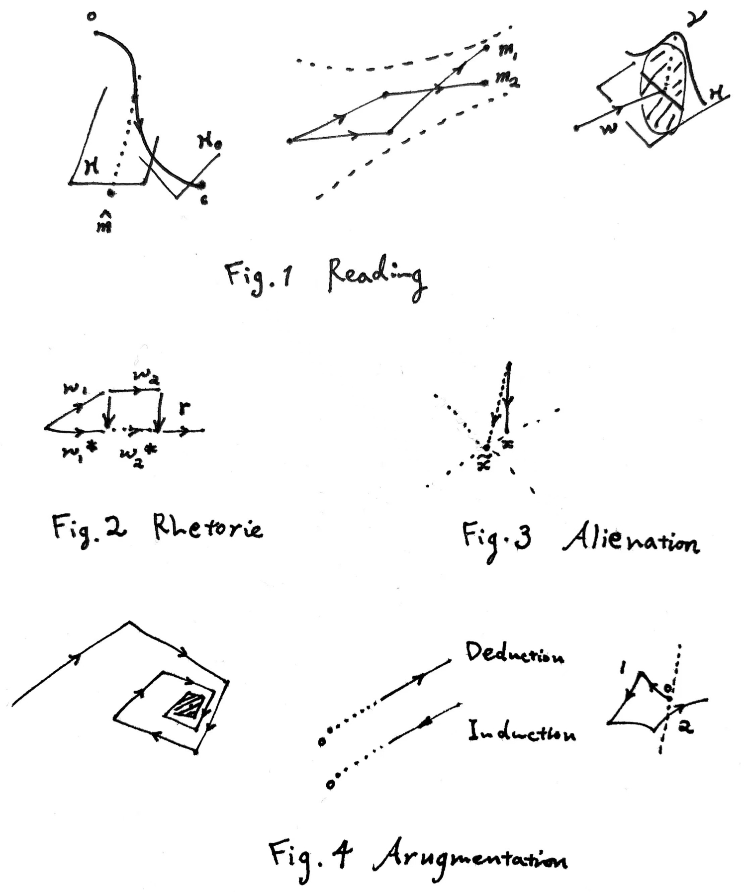

# Notion: Geometric Hermeneutics

### 语言的几何学阐释

#### Meaning

我们不能理解完全不依靠**现实**的意义。（现实指的不一定就是真实存在发生的，而是一种类似生活经验的东西）所有的意思（意义，关于另外一种 “意义” 见下一小节）都指代了一系列可能的现实世界过程（称作**宇宙** $u$）。某一时刻的宇宙 $u(t)$ 称作世界，是一系列状态信息的集合（能想象到的所有信息都可以如此纳入）$\{\pi^1,\pi^2,\dots\}$（暂时先把不可数的打包在一起，写成可数的形式；注意我们可以想象虚空中的抽象状态，但它仍然是一个与其他事实状态无二的东西）。一个半宇宙（前向/后向宇宙）指 $\{u_t\}_{t\ge 0}$ 或 $\{u_t\}_{t\le 0}$，包含一个给定的始终点 $u_0$。注意我们目前没说 $u(t)$ 随时间的变化满足一定的规律（比如 Newton's Law），它允许了一切天马行空的假设与想象力。所有这些平行宇宙的集合 $\mathcal{O}$ 称作**客观集**，鉴于它们都是思考的对象（因此可能可以认为启蒙运动是在扩展客观集）。建模时状态是**外禀**的；例如总有人知道电场的存在，有人的世界里是不知道的（“因为太愚昧或太聪明而获得自由的幻象” 亨利·詹姆斯《使节》）。对于某个读者来说，他所能理解的一切宇宙集合记作**知识域** $\mathcal{K}=\hat{\mathcal{O}}$。但这里面有一些宇宙大概是符合一些规律的，我们把符合该规律的集合称作**真域** $\mathcal{T}$；同样，比方说或许有人眼里 Newton's Law 和大家的不一样，故每个读者都有自己认为的真域 $\mathcal{U}=\hat{\mathcal{T}}$。**意思空间** $\mathcal{M}=\mathcal{P}(\mathcal{O})$，真理空间 $\mathcal{M}_T=\mathcal{P}(\mathcal{T})$。意思之间存在包含关系 $m_1\subset m_2$；空/**无知**意思点 $0\in \mathcal{M}$ 表示全集背景，无穷远/**未知**意思点 $\infty$ 代表空集，其没有任何可理解的意义。

我们可以对意思之间进行简单的运算，包括**反义** $m^c$、**且（独立）**$m_1\cap m_2$、**或** $m_1\cup m_2$。如果 $m_1, m_2$ 对应的文本是 $w_1, w_2$，总文本 $w=w_1w_2$ 对应的（作者的）意思是 $m$，$m$ 不一定是 $m_1\cap m_2$。**顺序和** $m_1+m_2$，我们需要定义嵌入映射 $\phi:u \mapsto u^+/u^-$ 将时间压缩进半宇宙内，以实现时间上的先后关系，故 $m_1+m_2$ $=\{u\in m_1\cap m_2: \exists \phi_1,\phi_2,u_1\in m_1,u_2\in m_2 \text{ s.t. }u=\phi_1(u_1)+\phi_2(u_2)\}$ 对应于顺叙的文本 $w$。（对于始终点的衔接问题，设想一群在 $T$ 后就暂停演化的宇宙；即使受到真视域的限制，注意到人脑中状态序列的有限性和模糊性，这一点仍然可以成立。）

对于**可能**性，可以设想一个**虚拟状态** $\chi$，有其取值范围和概率分布 $P_\chi$；因此 “苹果很可能是红的” 对于一个意识里几乎只认为苹果具有红色和绿色的读者来说，这句话的意思应由如 $\chi \text{ uni.dis. on } [0,1],$ $m= \{u(\text{exist red apples},\chi<0.8),u(\text{exist green apples},\chi<0.2)\}$ 表示。

#### Reading

任一文本片段 $w: \mathcal{M}\rightarrow \mathcal{P}(\mathcal{M})$，将一个前文的起始意思（**语境**）接续到下一个时刻所理解的意思上，以一个模糊的方式，故其像是一子集。

首先需要提及的一点是所谓阐释循环里的**视域** $\mathcal{H} \subset \mathcal{M}$，它限制了读者在阅读此段文本时可供理解选择的意思范围。我们知道伽达默尔和海德格尔认为存在一些（文本/作者视域和读者视域间的） gap，跨越空隙（pull up）即是**视域融合**/协商（Horizont-verschmelzung）；例如 “To spread around him that primeval joy / Which fill'd himself, he rais'd his *plastic* arm”（Akenside, The Plaesures of the Imagination），18世纪的诗人肯定不会觉得造物主举起了他的塑料假肢——如果打开封闭的历史视域，我们会理解成造物主举起他柔韧的手臂。赫希宣称意义归于作者的意识，如果只诉诸文本本身，它可以表达几乎任何东西；例如 “苹果烂了” 在某些玄幻的小说里是不是 “明天是世界末日” 的意思？（包含这些宇宙吗？）

事实上在这个框架里他们的观点是完全可以调和的。我们仍然认为文本作为一个功能性系统（福柯）具有自身的意义（die Sache 主题，or 'what is there'），且不同读者得到不同的阐释，**可能**不能客观的理解文本（偏见/前判断，反映在模型里便是视域）；但显然存在一个被指涉的思想（referred-to thought，语文老师：这道阅读理解题需要用别的话表达出作者的思想），阐释的获得很可能需要读者对真实作者（依其**意图**）进行一定的揣测（比如我知道我在阅读一个19世纪的小说），并根据可能释义的**价值** $\mathcal{V}(m)$（指成为意图的可能性，例如读者不会认为18世纪诗人想表达上帝具有一个塑料手臂；但也完全可能包括其他东西，比如读者自己的**偏好**）来（模糊的）选择最可能的意思。当目前视域内缺乏合理的解释时——这便代表着存在一个绝对的（准确而言，相对于世界上其他接触的文本）可接受释义的**阈值** $\mathcal{V}\ge\mathcal{V}_0$，视域的协商和调整就出现了。注意我们不区分意思和意义，而赫希所谓的 significance 意义是真实的、事后的意义（如评价某句话 “为所有人指明了方向”，赏析一段文字的技巧影响），我们不予以关照和考虑（相信这能够区分，尽管理解的文本意义就是携带现实偏见的）。（考虑到随意的造句练习或学习权威教材的时候，我们可能会把 $\mathcal{V}$ 视作一个正常数。）

伊瑟尔的想法更进一步，他强调足够大的空隙是必要的（“创新标准”），阅读过程需要 shocks 亦即不断顿悟的瞬间。这同样可以放在心流模型下，读者的效用来自于两部分：一是学习与娱乐过程（切换视域）带来的**心流**（将过于可预测的东西陌生化导致的期待与对期待的不信任形成的张力；且每个读者均有自己适合的学习斜率的范围，超出则会感到无趣/受挫），另一是**审美**与叙事的体验（史蒂文斯 “诗歌让可见之物变得朦胧一些”——你可以认为诗歌的释义像纤维丛那样——陌生化也会提供康德的形式的美感；同时，不只陌生化，小说对现实事物“摹仿的满足”也是受欢迎的，这也是很多对几乎只关注非解释性文本的伊瑟尔的批判的来源）。

**相似度** $s$ 是重要的，它反映了读者对意思的区分程度。Attention is all your need。我们把它作为一种宇宙间的距离度量开展，$s(u_1,u_2)$ 可以通过多种方式定义，如 $\sum\limits_i \alpha_id_i(\pi^i_1,\pi^i_2)$，其中 $i$ 是状态列表的索引。因此可以诱导出意思之间的距离 $s(m_1,m_2)$，甚至 Hausdorff 测度的方式构造子集的内积 $\langle m_1,m_2\rangle=\int f_{m_1}(u)f_{m_2}(u) d\mu$（互信息亦可）。（有些问题里不妨假设不同读者具有相似的 $s$。）

读者通过自己的判断准则来根据 $w$ 和前文 $m$  在视域 $\mathcal{H}$ 内生成新的阐释，依靠的便是 $\mathcal{V}_s(m)$ 作为一个评估函数（与 $s$ 有关）来选取较优的解 $\hat{m}=\max\limits_{x\in \mathcal{H}}\mathcal{V}_s(x)$；$s$、$\mathcal{V}_s$ 和 $\mathcal{H}$ 皆反映了读者的前判断。（一个可行的假设是理性读者，他们的价值函数反比于与真实意图间的距离。）前文可以是上下文吗？当然，事实上我们经常**回退**并重新改正视域和选取的释义，包括只依靠记忆力迅速改正。注意到搜索具有的保守与模糊性，最终认为的并不一定极优，且可能是一个（相对而言）很小的区域，把它确定的视作某一个点对接下来的分析没有本质差异（创作时的模糊性同理）。因此整个阅读阐释的过程可见图，$m, \mathcal{H}, s, \mathcal{V}$ 在过程中均会持续变化（比如说到 “这个苹果” 的时候，$s$ 会集中聚焦到与该苹果相关的状态身上）。关于伽达默尔所谓需要的共同基础，注意到这个可以相互理解的基础不是针对视域，而是对读者而言最大的知识域（假设他能够把视域扫描到整个知识域范围）。

**学习**过程就是在阅读某些文本时候（几乎皆通过扩张视域的方式）读者修改了 $\mathcal{U}$ 或 $\mathcal{K}$。如新知的获得必然带来 $\mathcal{K}$ 的扩大，且将视域重新置于新增的宇宙集合中；对于事实性文本，阅读时常有 $\mathcal{H}=\mathcal{U}$，不断改进该集合以认识真实世界，且此时读者主要任务是在理解意义，$\mathcal{V}$ 基本为常数，故叙述应越严谨越好（数学语言，或约定而非俗成的语言）。

语义的**信息量**仍可按照熟悉的方式定义，互信息 $I_s(m_1,m_2) = H_s(m_1)-H_s(m_1|m_2)$（在 $\mathcal{O}$ 上等概率的假定下，熵 $H_s(m)$ 可能取 $p_m=\frac{\mu(m)}{\mu(\hat{\mathcal{M}})}$ 时二值变量的形式）；单段文本的信息量即 $I_s(m)=I_s(m,0)$，$I(0)=0$。下标突出信息与读者的注意力有关，例如领导发言表示 “做好这一点非常重要”（记 $w'$，前文为 $w$），如果某人没有意识到敷衍执行会带来翻天覆地的后果，则在其眼里敷衍的宇宙和重视的宇宙非常相似，$I_s(m'|m)$ 会很小；同样，如果这是无聊的让所有人都不明其指的官话，信息量自然也非常少。一个两片段文本，当**上下文无关**即 $I(m_1,m_2)=0$ 时，（简单的并列文法下）易得 $I(m) = I(m_1)+I(m_2)$，此时记 $m= m_1\cap m_2$。

将假设总结一下的话便是：**Hyp1** 视域可扩张，且常保守的扩张；**Hyp2** 价值准则（仅揣测意图），且会回退；**Hyp3** 等概率原理。**模糊性**至少包括：$u$ 宇宙区分的；$w(m)$ 文本映射的；$m$ 意义选择的。

#### Language

正如上节所述，自然语言符号的暧昧性/模糊性导致了文本和意义的分离。我们想从符号学的角度强调几点：一，词汇符号具有**任意性**和**差异性**。符号本身是任意的，且它们的所指是通过差异化区分开来的（否定性的认知；我把它叫做船**仅仅**是因为它不是 “火车” “骡子” 等别的什么东西），这直接造成了自然文本的模糊性。二，一定的**约定性**。$\exists m, w(m)$ 未知。可以想象我们会因此对一些 $w$ 直接作出规则性的约定（肯定性而非否定性），如定义的概念、专有名词与语法结构。如果考虑完全约定性的数学语言系统，则它的文本能够完全定义概念（对于应可明确表达的意思可以称之为概念 $c\in \mathcal{M}$），表述命题和定理。（不讨论形式逻辑系统的实现，不关系是否自洽或完备。）三、符号意义的**管制**。$w$ 没有唯一确定的定义方式，似乎可以无厘头的把它的像变得很大，再由视域和价值限制它。“苹果烂了”当中的 $w=\{\text{烂了}\}, w(0)$ 是否可以包括 $m=\{\text{所有一个苹果烂了的宇宙}\}$ 还是 $m=\{\text{所有东西至少有一个烂了的宇宙}\}$？显然只纳入后者更符合直觉，我们应该遵从这一点。否则会陷入一种怀疑主义——不能完全失去对意义的经验的管制，尽管想象力和修辞极大的削弱了这一点。

其实之前并未展示清楚后文 $w_2$ 一般如何在前文 $w_1$ 的基础上推进意义（或者说 $w$ 映射的结构如何），这一点涉及到的便是构造意义时满足的一定的结构规则即**语法**。我们可以在诸多层级上划分 $w$，这些若干个 $w_i$ 通过不同层级的多种语法规则（词法、句法与文法）将各自的意思 $m_i$ 互相作用组织成总的意思 $m=g(m_1,\dots,m_k)$。从 Chomsky 的体系来看，我们可以近似找到一个最广的 CFL——称作**句法**（可以说我们处理句法规则时的思维跟 (N)PDA 其实也相差不多），里面的单元称作词（常表达一类事物、动作存在发生的宇宙）；如何用物理上更基本的元件组成它们是**词法**（morphology, phonology），我们无必要关注；而将句子表达出的复杂意思块进一步拼接的统称为**文法**（narratology etc.），通常是上下文相关的。如顺叙文法下，$g_{chron} = m_1+\dots+m_k$，而独立时 $g_{list}=m_1\cap \dots \cap m_k$ 可以称为并列文法/句法。

在这里还需要指出并区分词 $w$ 的两种类型：**实词**便是前面所描述的 $w: \mathcal{M}\rightarrow \mathcal{P}(\mathcal{M})$；**虚词**理论上可以视为它的特例，几乎只射向特定的异化的**结构性**语义，可以说 $w$ 的像均在特殊的（若干个）点 $\tilde{m}$（不具备任何真实世界状态的那些宇宙）上，它们（注意包括**标点**等）只有功能性的指征作用，但对意义加工非常重要。规则里每个成分的 $m_i$ 亦由正常阅读的流程及其 $\mathcal{H}_i$ 选出；一般而言，如果我们把远端视为更细化的意思，对于走向远端即意思会随着行文逐步精确（至少就作者而言）的文本，$\mathcal{H}_i \subseteq \mathcal{P}(m_i)$ for $i$ step。（当然，鉴于非确定性，要发挥语法规则也需要记忆力的参与。）

例如因果关系，$g(\text{因为},m_1,\text{所以},m_2)\subseteq\overline{m_1+\overline{m_2}} \cap \mathcal{H}$，因为还有很多情况下读者是通过想象许多可能的机制理解的，此时结果要远小于右边的项。

前面说到我们可以通过语法的组织结构以及一些基本的运算方式（由 “不”、“和”、“或” 等特定字符表征）进行加工，达到非常多样化的意思表达；而进一步让语言魅力丰富起来的，还有**修辞** $r: \mathcal{M}\rightarrow \mathcal{M}$（从字面义到实际欲表达的意义）。其包括比喻、象征、反复、举例等等手法，遗憾的是没人且为了美感也不允许进行校准（见下一小节），只能通过读者自己思考感悟。在修辞对应下后续进行释义的文本会存在一个**拉回** $w^*=r^*(w)$。正因为 $r$ 的模糊性，尼采才认为 “什么是真理呢？一群活动的隐喻、转喻和拟人法，也就是一大堆已经被诗意的和修辞的强化、转移和修饰了的人类关系”；他认为原本命名现实的语言遭受了陈腐修辞的征服性入侵，它们不再能被证实（显然），因此从语言滑向了信仰（异化）。

一般修辞的出现常由特定词汇（及慢慢俗成的短语）标识或被读者发现可靠的拉回义。还有很多词汇的历时变化由一些文本率先的尝试，经过受众尝试思考 $r$ 并固化下来导致。因此词汇的释义部分在使用中差异化及流变形成，部分由定义直接推得。

**异化**/虚化指词语出现的**本身**形式具备的内涵，纯粹由与其他语言语义的关系所存在，就像虚词那样。异化比我们想象的要普遍，常由一些社会环境因素或大规模的**失义**（$w(m)\cap \mathcal{H}=\infty$，评价很低 $\mathcal{V}\approx 0$）形成（或共同形成）。例如一个有权威的作者发表了大段的晦涩论述，而后面反倒很简单的义项被众人所理解了，大家却可能会开始反复使用前段的语汇、行文，最终以形成一异化的词义。当这样社会语境中的功能体系扩大之后，便容易出现语言陷阱（所谓 “牢笼”、差劣的意识形态，乔治·奥威尔《政治与英语》）。

（看到了吗？此处也精挑细选了论述的朦胧感。上段使用了未被详细挑明的晦涩、义项、语汇、社会语境等词，不知道屏幕前的读者又将怎样理解。）

#### Argumentation

再对一些更加整体的话题补充一下。行文时我们常会**引用**其他语录，或小说中人物展开了言语交流，这里都涉及到嵌套宇宙 $\{\pi^1,\dots,\pi^{nested}\}$，其中 $\pi^{nested}$ 是被引语言的所指，且基本都具有原宇宙中一些状态 $\pi^l$ 作为信息的物理载体（如发言人物的讲话行为等，但 “根据……” 很可能只依附于虚拟状态）。

在论述时，还会见到**反驳性**补充的现象（指会有与历史路径近似逆向的推进，并不一定有反驳这么显性，但对于读者原本所理解的一些较极化的词义会重新进行削弱；与之相对的**支持性**文本则沿着向论点的一个方向持续前进），这被概括为语言的**晶体性** crystallinity，亦即像在晶格里一样每个结晶出来的词汇都以量子化的方式推进意思，最终不断细化接近要点，见图。（图中还画了一种特殊的语言场合即辩论。）这是一种**校正**的方法，以阐明作者的论点所在（将正常读者的释义框限在可接受的小误差区域内，注意这不代表着论证的可靠性）。可以通过例题、举例与更多的段落/作品甚至社会层面进行校正。

论述逻辑上，常见的两大类**逻辑**归纳/演绎可以简洁的表示为由远/近处的宇宙集合推向近/远处的宇宙集合。

---

（我没有讨论包括无意识在内的一系列问题，但）我想应该用更多例子或者比上面更加清晰且优秀的理论框架来打败或修缮它，否则我可以自洽的维持这一体系并持续批驳那些企图通过长篇似明似暗的语文大论来阐释阐释学原理的人，因为这不是在写诗。